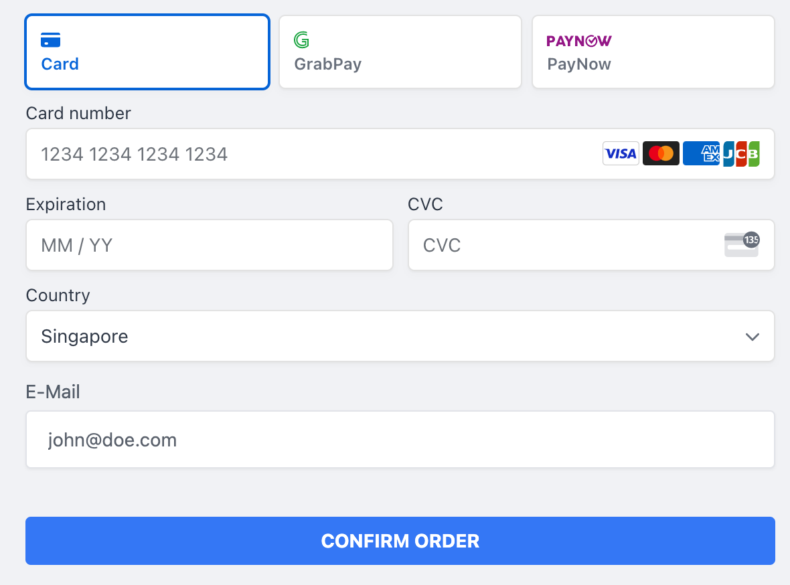
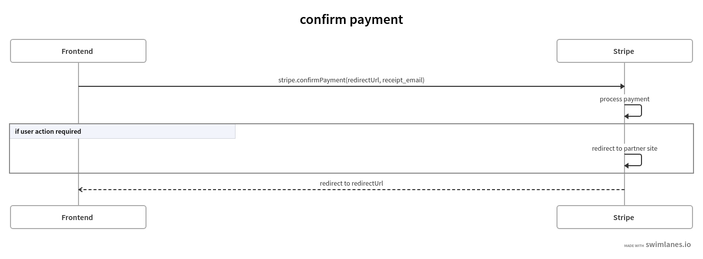

# pthiem's Written IE Project 
The web application developed for this demo is a simple web shop that allows customers to buy one Stripe Press book at a time. Customers are able to pick their book of choice, select a payment method, provide the respective payment method details and submit their order. To make a payment, one can select to use Credit Cards (incl. Google and Apple Pay), as well as GrabPay and PayNow. After the payment has been handled, a confirmation will be shown incl. order and payment details.  


## Repo
The public GitHub Repo can be found at https://github.com/pthiem-stripe/bookstore-demo

## Live Demo
Try out the live demo at https://pthiem-bookstoredemo.netlify.app/

## Getting Started Locally

Install Netlify CLI at version 9.6.5
```
npm install -g netlify-cli@9.6.5  
```


Install dependencies

```
npm install 
```

Create a netlify.toml file in the root directory with the following contents and insert your Stripe keys
```
[functions]
  directory = "functions"

[build]
environment = {STRIPE_SK = "sk_test_xxx", NEXT_PUBLIC_STRIPE_PK = "pk_test_xxx", NEXT_PUBLIC_SUCCESS_URL = "http://localhost:8888/success"}
```


Start netlify
```
netlify dev
```

## Solution Details

### Tech Stack
The demo is developed as a React-based **Next.js** app using **Tailwind CSS** and is hosted on **Netlify**. 

**Next.js** is a lightweight, React-based, hybrid SSG/SSR framework with (among other things) built-in routing, image optimization, internationalization, and a zero-config approach. This allows to spin up a working app with out-of-the-box routing without requiring any boilerplate code.   

**Tailwind CSS** is a utility-first, configurable CSS framework. It provides CSS helper classes to describe how items should be styled, rather than providing pre-defined components like frameworks such as Bootstrap.

**Netlify** provides web-hosting and automation services primarily for JAMstack websites with native support for Next.js and built-in integration with GitHub. Their service offering allows to have a GitHub-hosted Next.js app up and running without any configuration changes in less than 5 minutes. Another feature worth mentioning is Netlify Functions, which allows to set up serverless functions that can be deployed together with the frontend, therefore significantly reducing the effort/overhead in cases where small-scale backend functionality is required. 

### Payment Element

<p align="center">

</p>


The [Stripe Payment Element](https://stripe.com/docs/payments/payment-element) is used to collect payment information in a PCI-compliant way. The integration follows the steps described in [this article](https://stripe.com/docs/payments/accept-a-payment?ui=elements). The Payment Element is rendered in an iframe and securely transmits sensitive information (such as credit card details) to Stripe. The component needs a `payment_intent_client_secret` when initialized. This client secret is used to map the collected payment information to a `PaymentIntent`.  Once the user triggers to make a payment, the Payment Element transmits the payment information to Stripe to process and confirm the payment and handles redirects if additional user actions are required. 

<p align="center">

</p>


The component also carries out real-time validations, such as checking the credit card number format, expiration dates, etc. The appearance API was used to make slight changes to the Element UI to be more in line with the overall UI of the demo app.

The Payment Element is hidden until it is fully initialized, loaded, and can be rendered (signaled through the `onReady` event) to avoid flickering content. A loading spinner is shown on the page in the meantime.
### API Calls
The app makes 2 API calls in total during a purchase. The `/createPaymentIntent` call is necessary to create a [`PaymentIntent`](https://stripe.com/docs/api/payment_intents) and to get the `payment_intent_client_secret` that is required to initialize the Payment Element. The call to `/getPaymentIntentDetails` is done to retrieve additional information to be shown to the user to provide a better experience. These calls require the Secret Key to be passed along. Therefore, these calls are made by the Backend (Netlify Functions).
#### /createPaymentIntent

<p align="center">

</p>


As described, this call generates a `PaymentIntent` and passes the `payment_intent_client_secret` back to the frontend. The Backend uses the Stripe Node SDK to create a `PaymentIntent` using the following call:
```
  const paymentIntent = await stripe.paymentIntents.create({
    amount: reqBody.amount,
    currency: reqBody.currency,
    metadata: {
        sku: reqBody.sku,
    },
    automatic_payment_methods: { enabled: true },
  });
```

Amount, currency, and metadata are passed in as parameters by the frontend. By setting `automatic_payment_methods` to `enabled=true`, we allow the Payment Element to render and accept all suitable payment methods (e.g. depending on browser) as configured in the Stripe Dashboard. With this option, it is possible to enable new payment methods without making any code changes (as long as they are supported by the Payment Element).


#### /getPaymentIntentDetails


<p align="center">

</p>

The call to `/getPaymentIntentDetails` is made after the Payment Element redirected the user and is purely for informational purposes. The frontend passes the ID of the `PaymentIntent` to the Netlify Functions Backend and the Stripe SDK retrieves the `PaymentIntent`, afterwards the entire object is passed back to the Frontend. The Frontend uses this information to evaluate the status of the payment and to show details of the payment method used to make the payment. 


### User flow
As the app only allows one to buy one book at a time, the user flow is very straightforward. A user will select a book and then continues to make payment. A success page with payment and order details is shown if the payment is successful. In case the payment fails, the user will be redirected to an error page where they can opt to go back to the Checkout page (with their product still selected) to re-enter payment method details or select another payment method. The previously generated payment intent will be reused if the user opts to try again.

<p align="center">

</p>

The *Make payment* step can be further broken down into 
1. Selecting a payment method
2. If necessary, provide additional payment method details (such as credit card details)
3. Confirm the payment
4. If necessary, carry out additional user actions (such as scanning the PayNow QR code, 3DS challenge, etc.)

<p align="center">

</p>


### Extensions & Improvements
The current state of the app is very basic. To improve the user experience and grow the business, the following improvements and extensions could be implemented.
#### Cart Functionality
A Cart feature would allow users to check out multiple items and/or higher quantities of items.
#### Customer Accounts
Adding customer account functionality enables a whole subset of new features:
- Storing and reusing payment methods
- Order History
- Storing and reusing billing/invoicing addresses
- On-site refund/exchange requests
Besides better user experience, these features also collect valuable data about customer behavior. 

#### Use Stripe Customer Objects
Using Stripe Customer Objects and providing more customer-related information (such as addresses) helps with fraud prevention and analytics, and enables other useful features such as storing and reusing payment methods.

#### Subscriptions
Subscriptions (e.g. for monthly new releases) could be a way to expand the current business. Stripe APIs can be used to set up subscriptions. The customer portal can be made available to customers to manage their subscriptions.

#### Discount Codes
Discount Codes could be leveraged during promotion periods or for loyal customers.

#### Error handling
The current state of the app does not include proper error handling, e.g. for failing API calls.

#### Move to a scalable, managed backend
The Netlify backend is a nice way to quickly ramp up an app. It is limited in its ability to be configured and managed, e.g. logs are discarded after a few days.

### References used
[PaymentIntent Api](https://stripe.com/docs/api/payment_intents)


[Accepting a payment](https://stripe.com/docs/payments/accept-a-payment?ui=elements)


[Elements Apperance API](https://stripe.com/docs/elements/appearance-api)