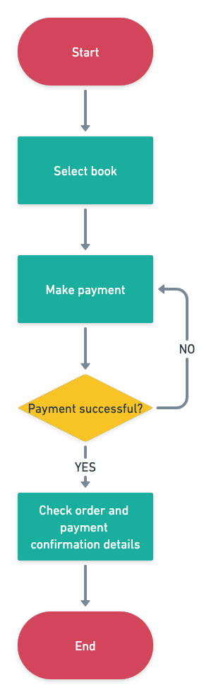

# pthiem's Written IE Project 
The web application developed for this demo is a simple web shop that allows customers to buy one Stripe Press book at a time. Customers are able to pick their book of choice, select a payment method, provide the respective payment method details and submit their order. To make a payment, one can select to user Credit Cards (incl. Google and Apple Pay), as well as GrabPay and Paynow. After the payment has been handled, a confirmation will be shown incl. order and payment details.  


## Repo
The public Github Repo can be found at https://github.com/pthiem-stripe/bookstore-demo

## Live Demo
Try out the live demo at https://pthiem-bookstoredemo.netlify.app/

## Getting Started Locally

Install Netlify CLI at version 9.6.5
```
npm install -g netlify-cli@9.6.5  
```


Install dependencies

```
npm install 
```

Create a netlify.toml file in the root directory with the following contents and insert your Stripe keys
```
[functions]
  directory = "functions"

[build]
environment = {NEXT_PUBLIC_VERSION = "local", STRIPE_SK = "sk_test_xxx", NEXT_PUBLIC_STRIPE_PK = "pk_test_xxx", NEXT_PUBLIC_SUCCESS_URL = "http://localhost:8888/success"}
```


Start netlify
```
netlify dev
```

## Solution Details

### Tech Stack
The demo is developed as a react-based **Next.js** app using **Tailwind CSS** and is hosted on **Netlify**. 

**Next.js** is a lightweight, react-based, hybrid SSG/SSR framework with (among other things) built-in routing, image optimization, internationalization, and a zero-config approach. This allows to spin up a working app with out-of-the-box routing without requiring any boilerplate code.   

**Tailwind CSS** is a utility-first, configurable CSS framework. It provides CSS helper classess to describe how items should be styled, rather than providing pre-defined components like frameworks such as Bootstrap.

**Netlify** is a cloud computing company from San Francisco providing web-hosting and automation services primarily for JAMstack websites. Netlify has native support for Next.js and built-in integration with Github. Their service offering allows to have a Github-hosted Next.js app up and running without any configuration changes in less than 5 minutes. Another feature worth-mentioning is Netlify Functions, which allows to setup serverless functions that can be deployed together with the frontend, therefore significantly reducing the effort/overhead in cases where small-scale backend functionality is required. 
### User flow
As the app only allows to buy one book at a time, the user flow is very straightforward. A user will select a book and then continues to make payment. A success page with payment and order details is shown if the payment is successful. In case the payment fails, the user will be redirected to an error page where they can opt to go back to the Checkout page  (with their product still selected) to re-enter payment method details or select another payment method. The previously generated payment intent will be reused, if the users opts to try again.

<p align="center">

</p>

The *Make payment* step can be further broken down into 
1. Selecting a payment method
2. If necessary, providing additional payment method details (such as credit card details)
3. Confirming the payment
4. If necessary, carrying out additional user actions (such as scanning the PayNow QR code, 3DS challenge, etc.)

<p align="center">

</p>


### API Calls


### Extensions & Improvements
#### Cart Functionality
#### Customer Accounts
#### Storing and reusing Payment Methods
#### Subscriptions
#### Discount Codes
#### Product API
#### Order API

### Challenges